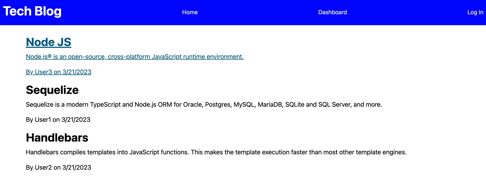

# blog-challenge

## Table of Contents
* [Description](#description)
* [Installation](#installation)
* [Usage](#usage)
* [Contributing](#contributing)
* [Tests](#tests)
* [License](#license)
* [Questions](#questions)
## Description:
This project is intended to create a tech blog full stack application that allows the user to create and log in to an account, make posts and comments, and view those made by others. This project was made as part of the requirements for a web development bootcamp.

## Installation:
N/A

## Usage:
* Navigate to the following link to view  the deployed application: https://blog-challenge.herokuapp.com/

* On the homepage, click Log In to either create a new account or log in to an existing one
* Once on the Log In page, enter the required fields and press the button to be logged in or signed up (if you sign up, you will be logged in automatically to the account you create)
* After logging in, you will be able to add posts by going to Dashboard and clicking on New Post
* You can also update or delete existing posts by clicking on them in your Dashboard
* To add a comment to existing posts, navigate to the Home page and click on the post you would like to add a comment to, then click Add Comment
* To log out, click Log Out (you will be logged out automatically after 30 min)

## Contributing:
In order to contribute, please feel free to fork the repo and submit a pull request with your suggested improvement.

## Tests:
N/A

## License:
[MIT License](https://opensource.org/license/mit/)

      Permission is hereby granted, free of charge, to any person obtaining a copy of this software and associated documentation files (the “Software”), to deal in the Software without restriction, including without limitation the rights to use, copy, modify, merge, publish, distribute, sublicense, and/or sell copies of the Software, and to permit persons to whom the Software is furnished to do so, subject to the following conditions:
      
      The above copyright notice and this permission notice shall be included in all copies or substantial portions of the Software.
      
      THE SOFTWARE IS PROVIDED “AS IS”, WITHOUT WARRANTY OF ANY KIND, EXPRESS OR IMPLIED, INCLUDING BUT NOT LIMITED TO THE WARRANTIES OF MERCHANTABILITY, FITNESS FOR A PARTICULAR PURPOSE AND NONINFRINGEMENT. IN NO EVENT SHALL THE AUTHORS OR COPYRIGHT HOLDERS BE LIABLE FOR ANY CLAIM, DAMAGES OR OTHER LIABILITY, WHETHER IN AN ACTION OF CONTRACT, TORT OR OTHERWISE, ARISING FROM, OUT OF OR IN CONNECTION WITH THE SOFTWARE OR THE USE OR OTHER DEALINGS IN THE SOFTWARE.
      
      
## Questions:
Please reach out at either of the following locations if you have any additional questions:
* GitHub: [keimdm](https://github.com/keimdm)
* Email: dmk252@cornell.edu
